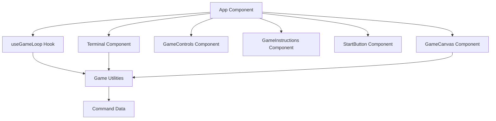
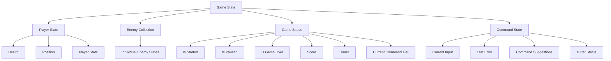
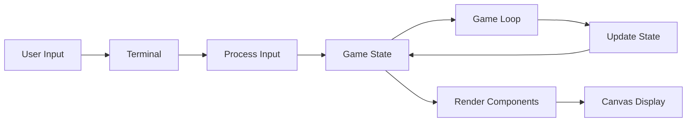

# System Patterns: AMonsterBASH

## Architecture Overview

AMonsterBASH follows a React-based architecture with TypeScript for type safety. The application is built using Vite as the build tool and uses a component-based structure with hooks for state management and game logic.

## Core Components

### App Component
- Main container component
- Orchestrates the game components
- Manages the overall layout and UI structure
- Utilizes the useGameLoop hook for game state management

### GameCanvas Component
- Renders the game visuals using HTML Canvas
- Displays player, enemies, health bars, and game state information
- Handles the visual representation of the game state
- Renders console input and feedback

### Terminal Component
- Manages user input for bash commands
- Processes command input against enemy commands
- Provides command suggestions
- Handles keyboard events

### GameControls Component
- Provides UI controls for game actions (pause, resume, restart)
- Displays game state controls based on current state

### GameInstructions Component
- Displays game instructions and command information
- Provides educational context for the bash commands

### StartButton Component
- Initiates the game
- Controls the game start state

## State Management

The game uses a custom hook (useGameLoop) to manage the game state and logic:

## Key Design Patterns

### Game Loop Pattern
- Implemented in useGameLoop hook
- Uses requestAnimationFrame for smooth animation
- Manages game timing, enemy spawning, and state updates
- Handles delta time for consistent game speed

### Command Pattern
- Commands are structured data objects with properties:
  - command: The actual bash command text
  - description: Explanation of what the command does
  - tier: Difficulty level of the command

### Factory Pattern
- Enemy creation is handled by factory functions
- createEnemy function generates enemies with appropriate properties
- Supports creation of regular enemies and boss enemies

### Observer Pattern
- Game state changes trigger UI updates through React's state management
- Components observe and react to changes in the game state

## Data Flow

1. User types bash commands in the Terminal component
2. Commands are processed against enemy commands
3. Game state is updated based on command matches
4. Game loop continuously updates enemy positions and game state
5. Canvas renders the updated game state
6. Process repeats until game over condition is met

## Technical Decisions

1. **Canvas Rendering** - Used for efficient game graphics rendering
2. **React Hooks** - Used for state management and side effects
3. **TypeScript** - Provides type safety and better developer experience
4. **Vite** - Fast build tool with hot module replacement
5. **Tailwind CSS** - Utility-first CSS framework for styling
